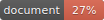

# Ylide Protocol Client SDK



This is the Client SDK for browser environment to use in dApp or regular web applications. First of all, you should install this library, than you should install appropriate blockchain library.

## Installation

To install SDK with Everscale support, use;

```shell
$ npm install --save @ylide/sdk @ylide/everscale
```
